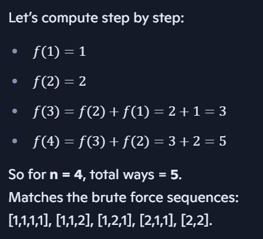

# Numbers

## 1. Armstrong Number
An Armstrong number is a number that is equal to the sum of its own digits each raised to the power of the number of digits.
**Example**: 
- `153` has `3` digits: 1<sup>3</sup> + 5<sup>3</sup> + 3<sup>3</sup> = 153
- `9474` has `4` digits: 9<sup>4</sup> + 4<sup>4</sup> + 7<sup>4</sup> + 4<sup>4</sup> = 9474

## 2. Prime Number (Square root method)
- If a number `num` is composite, it can be written as `num = a × b`.
- Here, `a` and `b` are factors of `num`.
- One of these two factors must be `≤ √num`, and the other must be `≥ √num`.
    - Example: `36 = 6 × 6` → both equal to `√36`.
    - Example: `36 = 4 × 9` → one factor (`4`) is below `√36`, the other (`9`) is above `√36`.
- If num has any factor greater than √num, its paired factor will be smaller than √num.
- So if no divisor is found up to √num, there cannot be any divisor beyond √num either.
- That means the number must be prime.
**Example**: `n = 12`
- Factors: `1, 2, 3, 4, 6, 12`
- Pairs: 
    ```
    1 × 12
    2 × 6
    3 × 4
    ```
    - √12 ≈ 3.46
    - Notice in each pair:
        - One factor is ≤ 3.46 (the smaller one).
        - The other factor is ≥ 3.46 (the larger one).

## 3. Perfect Number
A number is a perfect number if it is equal to sum of its proper divisors, that is, sum of its positive divisors excluding the number itself.

**Example**:
```
Input: n = 6
Output: true
Divisors of 6 are 1, 2 and 3. 
Sum of divisors is 1 + 2 + 3 = 6
```

## 4. All divisors of a natural number
**Divisor Logic Explained**

### i. Divisors come in pairs
For any number `num`, if `i` divides `num`, then `num / i` is also a divisor.  
So divisors always appear as pairs: `(i, num/i)`.

**Example:**  
- For `12`, divisors are `(1,12), (2,6), (3,4)`.

### ii. Why loop only till √num
- If you go beyond √num, you’ll just be repeating the same pairs in reverse.  
- Example:  
  - At `i = 2`, you get `(2,6)`.  
  - At `i = 6`, you’d get `(6,2)` — already covered.  
- So looping until `i * i <= num` ensures you cover all unique pairs.

### iii. Role of `i` and `num/i`
- `i` is the **smaller divisor** in the pair.  
- `num/i` is the **larger divisor** in the pair.  

**Example:** For `12`:  
- When `i = 2`, smaller divisor = 2, larger divisor = 12/2 = 6.  
- Together they form the pair `(2,6)`.

### iv. Why the condition `if (i != num/i)`
- Special case: perfect squares.  
- Example: `36 = 6 × 6`.  
- Here both divisors are the same.  
- Without the condition, you’d add `6` twice.  
- So `if (i != num/i)` avoids duplicates.

### v. Why sorting at the end
- Divisors are added in mixed order: first the small `i`, then the large `num/i`.  
- Example for `36`: insertion order = `[1,36,2,18,3,12,4,9,6]`.  
- This is not sorted.  
- Sorting ensures the final list is in ascending order.

### vi. Complexity
- Loop: **O(√n)** iterations.  
- Sorting: **O(k log k)**, where `k` is the number of divisors (≤ 2√n).  
- Overall: **O(√n log √n)**.


## 5. Perfect Square
A perfect square is a number that can be expressed as the square of an integer.
**Example**:
- √36 = 6 → integer → perfect square.
- √20 ≈ 4.47 → not integer → not a perfect square.

## 6. Add number until you get output as only one digit
### i. Digital Root Formula
The digital root of a positive integer is the single-digit value obtained by an iterative process of summing digits, on each iteration using the result from the previous iteration to compute a digit sum. The process continues until a single-digit number is reached.

Example: the digital root of `65,536` is `7`, because `6 + 5 + 5 + 3 + 6 = 25` and `2 + 5 = 7`

**Formula:** The digital root of `n` is equal to the remainder when `n` is divided by `9`
- `dr(n) = 1 + ((n - 1) % 9)`

This formula gives us the digital root of n directly, without having to perform any iterative digit summing

```
dr(65,536) = 1 + ((65,536 - 1) % 9)
           = 1 + (65,535 % 9)
           = 1 + (7)
           = 8
```

*  **Why we didn't directly calculate modulo of number with 9?**
    - The digital root is the repeated sum of digits until you get a single digit. 
    - Mathematically, it’s equivalent to the number’s value modulo 9, with one special 
    - `1 + ((n - 1) % 9)` this is normalized version of the modulo operation that avoids the special case when `n mod 0 = 0`.
    - Here's the issue:
        - If you just do `n mod 9` then multiples of 9 give 0.
        - Example: `18 % 9 = 0`
          But the digital root of 18 is `1 + 8 = 9`.
          So, we want `9` instead of `0`. That formula fixes it.
        - If `n` is a multiple of 9, `n - 1` is less, so `(n - 1) mod 9 = 8`. Then `1 + 8 = 9` which is correct digital root. 

### ii. Time Complexity of `addDigits`
- Each iteration removes one digit from num (num /= 10).
- So the number of iterations = number of digits in num.
- If `num` has value `𝑛`, the number of digits ≈ log<sub>10</sub>(𝑛).
    - Example:
        - 𝑛 = 999 → 3 digits → log<sub>10</sub>(999) ≈ 3
        - 𝑛 = 1000000 → 7 digits → log<sub>10</sub>(1000000) ≈ 6
So the loop runs O(log n) times, not O(n).
- Think of it like this:
    - Each division by 10 shrinks the number drastically.
    - So the number of steps grows with the length of the number, not its magnitude.
    - Length of the number = log<sub>10</sub>(𝑛)

## GCD (greatest common divisor)
It's used to find largest positive integer that divides both numbers without a remainder.
For example, the GCD of 8 and 12 is 4, because 4 is the largest positive integer that divides both 8 and 12 without a remainder.

- To find GCD we use **Euclidean algorithm**. It's an efficient way to find GCD.

Using Recursion,
```
int gcd(int a, int b) {
    if (b == 0)
        return a;
    return gcd(b, a % b);
}
```

Without using Recursion,
```
int gcd(int a, int b) {
    while (b != 0) {
        int temp = b;
        b = a % b;
        a = temp;
    }
    return a;
}
```


## Climbing Stairs

Explaination: [Copilot Explaination](https://copilot.microsoft.com/shares/J1G9bP1TRNfSRN2kjXzSg)

### 1. Brute Force Solution (using recursion)
- We can use recursion/backtracking:
    - Start at stair 0.
    - At each point, try taking a 1‑step or a 2‑step.
    - Stop when you reach exactly n.
    - If you go beyond n, discard that path.

- Example: n = 4
    ```
    1 + 1 + 1 + 1
    1 + 1 + 2
    1 + 2 + 1
    2 + 1 + 1
    2 + 2
    ```

    Recursive Tree
    ```
    Start (0)
    ├── take 1 → sum=1
    │     ├── take 1 → sum=2
    │     │     ├── take 1 → sum=3
    │     │     │     ├── take 1 → sum=4 ✅ [1,1,1,1]
    │     │     │     └── take 2 → sum=5 ❌ (too far)
    │     │     └── take 2 → sum=4 ✅ [1,1,2]
    │     └── take 2 → sum=3
    │           ├── take 1 → sum=4 ✅ [1,2,1]
    │           └── take 2 → sum=5 ❌ (too far)
    └── take 2 → sum=2
        ├── take 1 → sum=3
        │     ├── take 1 → sum=4 ✅ [2,1,1]
        │     └── take 2 → sum=5 ❌ (too far)
        └── take 2 → sum=4 ✅ [2,2]

    ```

- Complexity: 
    - Time complexity:
        - Each step branches into 2 choices → recursion tree size ≈ O(2^n).
        - For n = 4, small tree. For large n, exponential growth.
        - Exact number of valid sequences = Fibonacci(n+1).

    - Space complexity:
        - Maximum recursion depth = n (all 1‑steps).
        - So space = O(n).

### 2. Optimized Approach (using Fibonacci Logic)
Instead of printing every sequence (brute force), we just count them using a recurrence relation:
- To reach stair 𝑛, your last move could be:
    - From stair 𝑛 − 1 (a 1‑step), or
    - From stair 𝑛 − 2 (a 2‑step).

So:    f(n) = f(n — 1) + f(n — 2)
This is exactly the **Fibonacci relation**.

- Base cases
    - f(1) = 1 → only [1]
    - f(2) = 2 → [1+1], [2]

- Example:
    