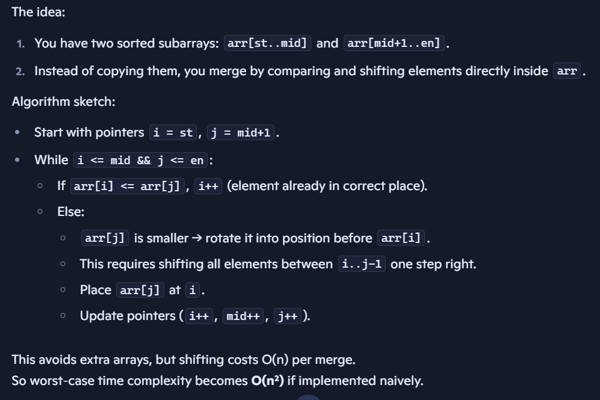
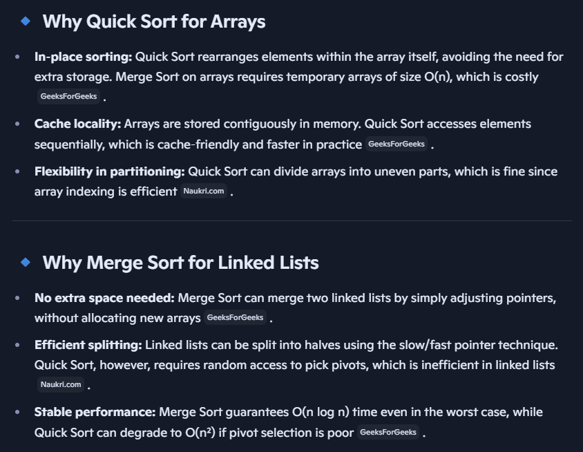
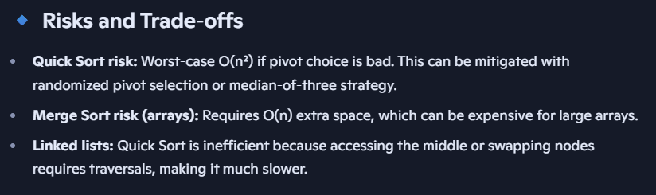
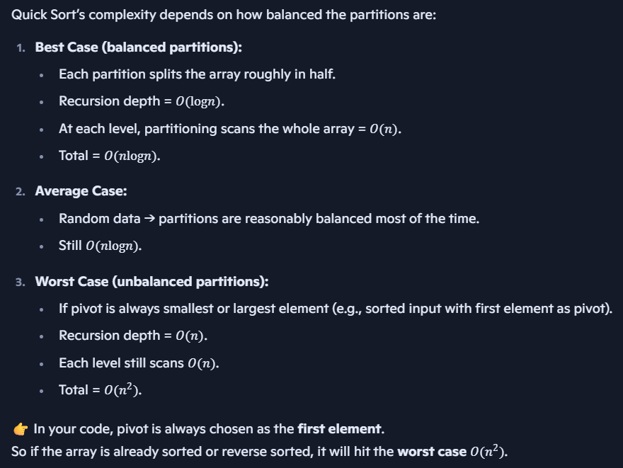

# Sorting algorithms using recursion

## Merge Sort

**Note**: Merge Sort is faster than Selection, Insersion and Bubble sort.

Merge Sort: You can sort is using **two methods**,
- **Create a new array and copy values**
- **Use indexes**

**Visualizing the recursive flow**

Initial array:
```
[38, 27, 43, 3, 9, 82, 10]
```

Step 1: First split
```
Left: [38, 27, 43, 3]
Right: [9, 82, 10]
```

Step 2: Split left part [38, 27, 43, 3]
```
Left: [38, 27]
Right: [43, 3]
```

Step 3: Split [38, 27]
```
Left: [38]
Right: [27]
→ Merge → [27, 38]
```

Step 4: Split [43, 3]
```
Left: [43]
Right: [3]
→ Merge → [3, 43]
```

Step 5: Merge [27, 38] and [3, 43]
```
→ [3, 27, 38, 43]
```

Step 6: Split right part [9, 82, 10]
```
Left: [9, 82]
Right: [10]
```

Step 7: Split [9, 82]
```
Left: [9]
Right: [82]
→ Merge → [9, 82]
```

Step 8: Merge [9, 82] and [10]
```
→ [9, 10, 82]
```

Step 9: Final merge
Merge left sorted part [3, 27, 38, 43] and right sorted part [9, 10, 82]:
```
→ [3, 9, 10, 27, 38, 43, 82]
```

**Recursion Flow**
```
[38,27,43,3,9,82,10]
        /                 \
 [38,27,43,3]           [9,82,10]
   /       \              /     \
[38,27] [43,3]       [9,82]   [10]
 /   \    /   \       /   \
[38] [27] [43] [3]  [9] [82]

```
- Recursion goes down to single elements.
- Then merges happen bottom-up:
    - `[38] + [27] → [27,38]`
    - `[43] + [3] → [3,43]`
    - Then `[27,38] + [3,43] → [3,27,38,43]`
- Similarly on the right side.
- Finally, the two halves merge into the fully sorted array.

**Time Complexity**:
- Merge sort works in two phases: divide and merge.

1. Divide phase (recursion depth):
    - Each time, the array is split into two halves.
    - This continues until subarrays of size 1.
    - Number of times you can split an array of size n = log n
    - So recursion depth = O(log n)

2. Merge phase (work per level):
    - At each level of recursion, you merge all subarrays back together.
    - Merging two sorted halves of total size n takes O(n)
    - Across a level, all merges together still process the entire array once → O(n)

3. Total work:
    - Work per level = O(n)
    - Number of levels = O(log n)
    - Total = O(n log n)

**Space Complexity**
Merge sort needs extra arrays to merge halves:
- At each merge step, temporary arrays are created to hold left and right halves.
- For an array of size 𝑛, the largest temporary storage needed is O(n)
- Recursion stack depth = O(log n), but that’s much smaller than O(n)
- So overall space complexity = O(n).

## Merge Sort (Inplace) using indexes
- 

**Note**:
- Merge sort with O(n) extra space is optimal for performance (O(n log n)).
- In‑place merge sort reduces space to O(log n), but increases time complexity (can degrade to O(n²)).
- That’s why in practice, we accept O(n) space for merge sort.

- Standard merge sort: O(n log n) time, O(n) space.
- In‑place merge sort: O(log n) space, but merging requires shifting → can degrade to O(n²).

## Why Quick Sort preferred for Arrays and Merge Sort for Linked Lists?
**Quick Sort is generally preferred for arrays because it is in‑place and cache‑friendly, while Merge Sort is preferred for linked lists because it avoids extra memory allocation and works efficiently with pointer manipulation.**






## Quick Sort:
**Time complexity**:


**Space complexity**:
- Quick Sort is in-place (explained below), so no extra arrays are created.
- Only recursion stack consumes space.
- Depth of recursion:
    - Best/Average case: O(log n)
    - Worst case: O(n)

So space complexity = O(log n) average, O(n) worst case.