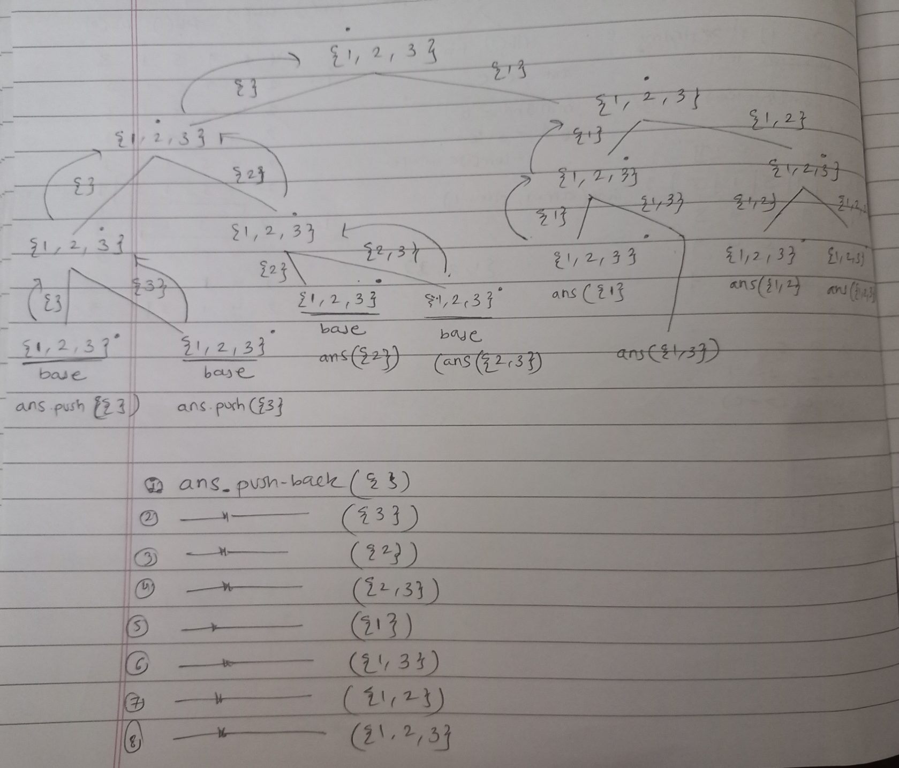
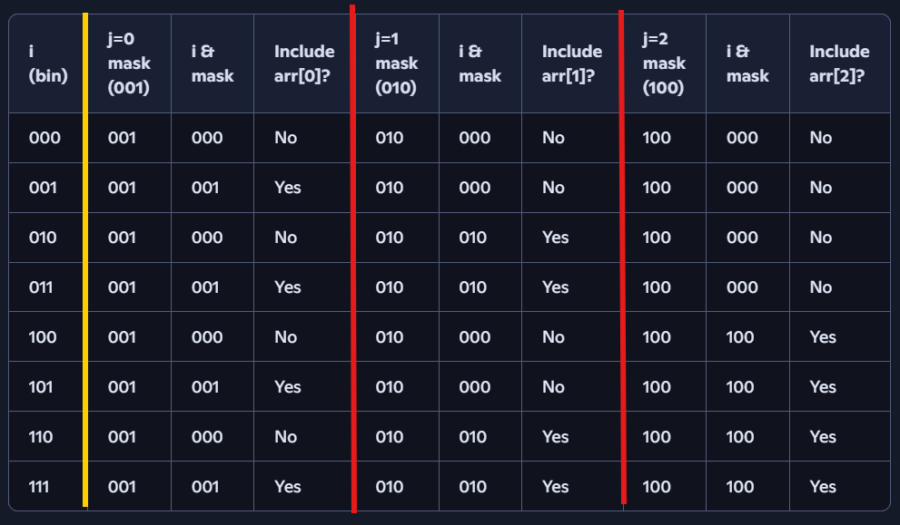

# Recursion

Recursion is a powerful concept in computer science and programming. It is a method where a function calls itself directly or indirectly until a certain condition, known as the base case, is met. This technique is particularly useful when the solution to a complex problem depends on the solution to smaller instances of the same problem.

## Understanding Recursion with an Example
Consider the following simple example of a recursive function in C++:

```cpp
void solve(int n) {
    if (n == 0) return; // base case
    // some code here...
    solve(n - 1); // recursive call
}
```
In this code, solve is a recursive function that calls itself with a smaller value of n until n becomes zero.

## Key Components of Recursion
There are three key components in recursion:

**Base Case:** This is the condition that stops the recursion. Every recursive function should have a base case to prevent it from calling itself indefinitely, leading to an infinite loop and potentially causing a stack overflow error.

**Recursive Relation:** This is the relationship that breaks down the problem into smaller instances of the same problem. For example, consider the problem of calculating 2<sup>n</sup>. We can express this as 2<sup>n</sup> = 2 * 2<sup>n - 1</sup>. In this case, f(n) = 2 * f(n - 1) is the recursive relation.

**Processing:** This refers to any computations or operations that the function performs.

## Types of Recursion
Depending on where the recursive relation appears in the function, recursion can be classified into two types:
- **Tail Recursion**: If the recursive relation is at the end of the function.
- **Head Recursion**: If the recursive relation comes before any processing in the function.


## Stack Overflow in Recursion
Recursion uses an in-built stack to store recursive calls. Hence, it’s important to limit the number of recursive calls to avoid memory overflow. If the number of recursion calls exceeds the maximum permissible amount, it will exceed the recursion depth, leading to a condition called stack overflow.

More information on Memory Allocation (You can also refer to `/[08] Memory Allocation/`)
1. **Types of memory in a program**
    - **Static (Global/Code segment)** → stores global variables, constants, compiled code.
    - **Heap (Dynamic memory)** → large pool, managed manually (new, malloc, etc.), flexible size.
    - **Stack** → automatically managed, stores:
        - Function call frames
        - Local variables
        - Parameters
        - Return addresses

2. **Why stack memory is limited**
    - The stack is fixed-size when the program starts.
        - On most systems, it’s a few MB (e.g., 1 MB, 8 MB, sometimes configurable).
    - The heap can grow much larger (hundreds of MB or GB), but the stack is kept small because:
        - It must be fast (push/pop operations).
        - It grows and shrinks predictably with function calls.
        - Large stack sizes would risk colliding with the heap in memory layout.
    So yes, stack memory is intentionally kept small.

3. **Stack frames and overflow**
    - Each function call creates a stack frame:
        - Parameters
        - Local variables
        - Return address
    - The size of a frame depends on the function:
        - A simple function with a few `int` → small frame.
        - A function with a huge local array (e.g., `int arr[1000000]`) → very large frame.

    **Two ways stack overflow can happen:**
    - **i. Too many recursive calls** → many frames stacked up.
    - **ii. One frame too large** → a single function allocates a huge local variable, exceeding stack size.
    It’s not only “too many functions” that cause overflow. A single function with a massive local allocation can also overflow the stack.

4. **Example:**
    ```cpp
    void recurse(int n) {
        int arr[1000000]; // ~4 MB local array
        if(n > 0) recurse(n-1);
    }
    ```
    - Even one call may overflow if stack size is 1 MB.
    - Or, if stack size is 8 MB, a few recursive calls will overflow.

5. **Why not just give stack more memory?**
    - Stack is designed for **speed and predictability**.
    - Heap is for **large, flexible allocations**.
    - If you need big data structures → allocate on heap (`new`, `malloc`).
    - If you need recursion → keep depth reasonable or convert to iterative.
    

## Importance of Return Statement in Recursive Functions 
(For functions returning any value - not for `void`. In `void` no explicit return is required)
While your code may work as expected without explicitly returning a value in all code paths for a function that is expected to return a value, it’s generally considered good practice to do so. This helps prevent potential bugs and makes your code easier to understand and maintain.

For instance, consider an example where we check if an array is sorted or not using recursion. In this case, we don’t need to use the return keyword because the function will always terminate before coming back from the base case.
Ex. `/array_is_sorted_or_not.cpp`

However, if you were to modify your function in the future or use a similar pattern in a different function, forgetting to return a value could lead to unexpected behavior. Therefore, it’s generally recommended to always explicitly return a value when a function is expected to do so. This makes your code more robust and easier to maintain and understand.

- **Remember: Just solve one case and the rest will happen automatically.** 
"बस एक केस सोल्व करो बाकी सब अपने आप हो जाएगा." - <a href="https://youtu.be/zg8Y1oE4qYQ?si=WLbLKLG8v2wZ9MYw&t=251">Love Babber</a>
- In `reach_home.cpp` example after `src == dest` then function stack is going to empty by `reach_home(10, 10)` will be removed from stack first then `reach_home(9, 10)` ..... `reach_home(1, 10)` like that.

- `Sum_of_array_elements.cpp` recursive tree <br>
    


## Why Shouldn’t We Use Recursion for Linear and Binary Search?
- Both recursive and iterative versions of linear search have a time complexity of O(n). However, in terms of space complexity, the recursive version uses O(n) space due to the call stack, while the iterative version uses O(1) space. Therefore, from a space complexity standpoint, the iterative approach is more optimal.
- Also, recursion involves function call overheads and can lead to stack overflow for large inputs. So, in general, for a problem like linear search where a simple iterative solution exists, it’s usually more efficient to use the iterative approach. But remember that recursion can be very useful and elegant for problems where the solution involves solving smaller instances of the same problem.
- Same explanation for binary search
- Points: 
    - **Stack Overflow:** Recursive functions use a call stack to handle function calls. If the depth of recursion is too high, it can lead to a stack overflow error. In the case of linear search, if the array size is large, using recursion could potentially lead to this issue.

    - **Overhead of Function Calls:** Each recursive call adds an extra layer of function call overhead. This includes the cost of pushing and popping elements from the call stack, which can make recursion slower than iteration for algorithms like linear and binary search.

    - **Space Complexity:** Recursive implementations of these algorithms have a higher space complexity (O(n) for linear search and O(log n) for binary search) due to the additional space required on the call stack. On the other hand, iterative versions of these algorithms only require constant O(1) space.

    - **Readability and Simplicity:** While recursion can make some complex algorithms more readable and easier to understand, this is not necessarily the case for simple algorithms like linear and binary search. An iterative approach can be just as readable, if not more so, and doesn’t come with the potential drawbacks of recursion.

## Bitwise or Arithmetic Operations?
- Both if(n & 1) and if(n % 2 == 0) can be used to check if a number is odd or even, respectively. However, the choice between the two often depends on the specific situation and requirements:

- Performance: Bitwise operations are generally faster than arithmetic operations. So, n & 1 might be slightly faster than n % 2. However, modern compilers are very good at optimizing such operations, and the difference is usually negligible in practice.

- Readability: For someone unfamiliar with bitwise operations, n % 2 == 0 might be more readable and immediately understandable as it directly translates to “if n divided by 2 leaves a remainder of 0, then n is even”.

- In general, unless you’re working in a performance-critical context, it’s often better to prioritize code readability and clarity. So, n % 2 == 0 might be preferred in most cases. But if you and your team are comfortable with bitwise operations and performance is a concern, n & 1 could be a good choice. It’s always important to consider the trade-offs in your specific context.

### Problem: a raised to b


This apporach will take less iterations to solve.
If we took example 1024 then with normal approach it will take 1024 iterations but with this optimized solution it will take very less iterations.
In this case, it's taking only 11 iterations.


## Sorting Algorithms
Note: Merge Sort is faster than Selection, Insersion and Bubble sort.

1. Merge Sort: You can sort is using two methods,
    - Create a new array and copy values
    - Use indexes

2. Quick Sort: 
    -  Partition
        - Take a pivot
        - Count all elements less than pivot.
        - Pivot = starting index + count; It's a position of pivot.
        - Satisfy condition --> right part > pivot element and left part < pivot element.

    ii. Recursion

3. Subset and Subsequences:
    - Bit manipulation
    

    

4. Phone keypad problem example
    

5. Permutations of String
    

6. Rat in maze
    - Input is a 2D array.
    - Each block contains 1 or 0.
    - 1 means rat can go in block which contain 1. (1 = open path)
    - 0 means rat can't go there. (0 = close path)
    - Rat's initial block is 0,0. Src(0, 0)
    - destination is dest(n-1, n-1)
    - Rat can only move left, right, top, down.
    - we've to provide all the solutions by which rat can reach the destination
    

    - movements
        - up --> (x - 1, y)
        - down --> (x + 1, y)
        - left --> (x, y - 1)
        - right --> (x, y + 1)

    - conditions to check (safe to move)
        - rat should be in the maze and not outside of 2D array
        - position to which rat is going should be 1 (open path)
        - position to which rat is going should be unvisited.
        - when function call returns, visited position should mark with false (not-visited). Because we've to find all posible paths.


## Problems:
### 1. Birthday Timer
When you call a function: (Why we've not used any `return` statement?)
- A stack frame is created for that call.

- Local variables and parameters are stored there.
- Control jumps into the function body.
- When the function returns (either explicitly with return or implicitly at the end of the function), the stack frame is popped, and control goes back to the caller — specifically, to the line after the function call.

```
main()
  → bT(5)
       prints "5 days left"
       → bT(4)
            prints "4 days left"
            → bT(3)
                 prints "3 days left"
                 → bT(2)
                      prints "2 days left"
                      → bT(1)
                           prints "1 day left"
                           → bT(0)
                                prints "Happy Birthday!"
                                return;   // base case
```

Now unwind:
- bT(0) returns → control goes back to the line birthdayTimer(n - 1) inside bT(1).

- But after that line, there’s nothing else in bT(1). So bT(1) ends and pops off.
- Then control returns to bT(2) (to the line where it called bT(1)), sees nothing after it, ends.
- Same for bT(3), bT(4), bT(5).
- Finally back to main(), which ends after calling birthdayTimer.

Each call pops off naturally after the recursive call returns, even without an explicit return;.

### 2. Count ways to reach N-th Stair
Each call to `countWays(n)` makes two recursive calls: → `countWays(n-1)` and `countWays(n-2)`.

Recursion tree visualization (Let’s take n = 5 as an example):
```
countWays(5)
 ├─ countWays(4)
 │   ├─ countWays(3)
 │   │   ├─ countWays(2)
 │   │   │   ├─ countWays(1) → 1
 │   │   │   └─ countWays(0) → 1
 │   │   └─ countWays(1) → 1
 │   └─ countWays(2)
 │       ├─ countWays(1) → 1
 │       └─ countWays(0) → 1
 └─ countWays(3)
     ├─ countWays(2)
     │   ├─ countWays(1) → 1
     │   └─ countWays(0) → 1
     └─ countWays(1) → 1
```

Notice:
- countWays(3) is computed twice.
- countWays(2) is computed three times.
- As n grows, the number of repeated calls explodes.

Growth Pattern:
- At each level, the number of calls doubles (roughly).
- Depth of recursion = n.
- Total calls ≈ 2^𝑛

So the recurrence is: `T(n) = T(n - 1) + (T - 2) + 0(1)`
This solves to `O(2^n)`.

### 3. Subsets
- Example: `arr[3] = {1, 2, 3}`
    - Power Set is a set of all subsets.
    - Power Set = `{}, {1}, {2}, {3}, {1, 2}, {2, 3}, {1, 3}, {1, 2, 3}`
    - Power Set contains `2`<sup>n</sup> elements. So in our example, 2<sup>3</sup> = 8 elements

#### i. Bit Manipulation Example
**Bit shift operators**
- **Left Shift** `<<`: moves bits to the left by k positions.
    - Numeric effect: `x << k = x * 2`<sup>`k`</sup>
    - Example:
        - `1 << 0`: 1 stays 1 (binary “001” if we show 3 bits).
        - `1 << 1`: 1 becomes 2 (binary “010”).
        - `1 << 2`: 1 becomes 4 (binary “100”).
- **Right Shift** `>>`: moves bits to the right by k positions.
    - Numeric effect: x >> k = [x/2<sup>k</sup>]
    - Example with x = 1:
        - `1 >> 0`: 1
        - `1 >> 1`: 0
        - `1 >> 2`: 0

**From the Problem**
- **Why `(1 << size) = 2^size`**
    - **Lead idea**: shifting 1 left by size sets exactly the size-th bit and yields 2<sup>size</sup>.
    - **Examples**:
        - (1 << 3) = 8 (1000 in binary)
        - (1 << n) = 2^n

- **What `(i & (1 << j)) != 0`checks**
    - **Mask creation**: (1 << j) is a number with only the j-th bit set.
        - For `j = 0,1,2` → masks are `001`, `010`, `100` (in 3-bit view).
    - **AND test**: `i & (1 << j)` keeps only the j-th bit of i.
        - If the j-th bit of i is 1, the result is nonzero → include `arr[j]`.
        - If the j-th bit of i is 0, the result is 0 → exclude `arr[j]`.

- **Mini table**: i from 0 to 7 with masks for j = 0,1,2
    